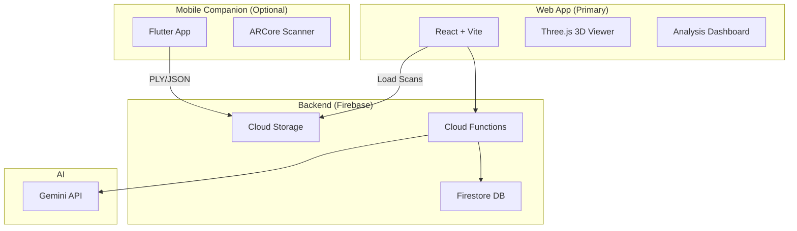

# 3D AI Accessibility Checker - Implementation Plan

> **Goal**: Web-based accessibility analyzer with optional mobile AR scanning

---

## System Architecture



---

## Tech Stack

| Component | Technology | Justification |
|-----------|------------|---------------|
| **Web Frontend** | React + Vite + TypeScript | Fast dev, type safety |
| **3D Rendering** | Three.js + React Three Fiber | Best WebGL library |
| **State** | Zustand | Lightweight, simple |
| **Styling** | TailwindCSS | Rapid UI development |
| **Mobile** | Flutter + ARCore | Google stack for KitaHack |
| **Backend** | Firebase Functions (Node.js) | Serverless, scalable |
| **Database** | Firestore | Real-time, NoSQL |
| **Storage** | Firebase Storage | Scan files, reports |
| **AI** | Gemini API | Required for KitaHack |
| **Auth** | Firebase Auth | Google sign-in |

---

## Project Structure

```
Ben10/
├── web/                          # React web app
│   ├── src/
│   │   ├── components/
│   │   │   ├── layout/
│   │   │   │   ├── Header.tsx
│   │   │   │   ├── Sidebar.tsx
│   │   │   │   └── Footer.tsx
│   │   │   ├── editor/
│   │   │   │   ├── Canvas3D.tsx          # Three.js scene
│   │   │   │   ├── FloorPlanGrid.tsx     # 2D grid overlay
│   │   │   │   ├── ElementPalette.tsx    # Drag-drop elements
│   │   │   │   ├── PropertiesPanel.tsx   # Edit selected
│   │   │   │   └── TransformControls.tsx # Move/rotate
│   │   │   ├── elements/
│   │   │   │   ├── Wall.tsx
│   │   │   │   ├── Door.tsx
│   │   │   │   ├── Ramp.tsx
│   │   │   │   ├── Stairs.tsx
│   │   │   │   ├── Table.tsx
│   │   │   │   └── Chair.tsx
│   │   │   ├── analysis/
│   │   │   │   ├── AnalysisOverlay.tsx   # Highlight issues
│   │   │   │   ├── IssueList.tsx         # Issue cards
│   │   │   │   ├── ScoreCard.tsx         # Accessibility %
│   │   │   │   ├── WheelchairPath.tsx    # Visualize path
│   │   │   │   └── SuggestionCard.tsx    # Auto-fix UI
│   │   │   └── common/
│   │   │       ├── Button.tsx
│   │   │       ├── Modal.tsx
│   │   │       └── LoadingSpinner.tsx
│   │   ├── hooks/
│   │   │   ├── useFloorPlan.ts           # Floor plan state
│   │   │   ├── useAnalysis.ts            # Trigger analysis
│   │   │   └── useAuth.ts                # Firebase auth
│   │   ├── services/
│   │   │   ├── api.ts                    # Backend calls
│   │   │   ├── firebase.ts               # Firebase init
│   │   │   └── gemini.ts                 # Gemini calls
│   │   ├── store/
│   │   │   └── floorPlanStore.ts         # Zustand store
│   │   ├── types/
│   │   │   ├── floorPlan.ts              # TypeScript types
│   │   │   └── analysis.ts
│   │   ├── utils/
│   │   │   ├── geometry.ts               # Math helpers
│   │   │   └── pathfinding.ts            # A* algorithm
│   │   ├── pages/
│   │   │   ├── Home.tsx
│   │   │   ├── Editor.tsx
│   │   │   ├── Analysis.tsx
│   │   │   └── Reports.tsx
│   │   ├── App.tsx
│   │   └── main.tsx
│   ├── public/
│   │   └── models/                       # 3D model assets
│   ├── package.json
│   ├── vite.config.ts
│   ├── tailwind.config.js
│   └── tsconfig.json
│
├── mobile/                       # Flutter companion
│   ├── lib/
│   │   ├── screens/
│   │   │   ├── scan_screen.dart
│   │   │   └── preview_screen.dart
│   │   ├── services/
│   │   │   ├── arcore_service.dart
│   │   │   └── firebase_service.dart
│   │   └── main.dart
│   └── pubspec.yaml
│
├── functions/                    # Firebase Functions
│   ├── src/
│   │   ├── index.ts
│   │   ├── analysis/
│   │   │   ├── rules.ts                  # Accessibility rules
│   │   │   ├── pathfinding.ts            # A* for backend
│   │   │   └── suggestions.ts            # Auto-fix logic
│   │   ├── gemini/
│   │   │   └── client.ts                 # Gemini API wrapper
│   │   └── reports/
│   │       └── pdf.ts                    # PDF generation
│   ├── package.json
│   └── tsconfig.json
│
├── shared/                       # Shared types
│   └── schemas/
│       ├── floor-plan.schema.json
│       └── analysis.schema.json
│
├── firebase.json
└── README.md
```

---

## Data Schemas

### Floor Plan Schema

```typescript
interface FloorPlan {
  id: string;
  userId: string;
  name: string;
  spaceType: 'cafe' | 'classroom' | 'clinic' | 'office' | 'custom';
  createdAt: Date;
  updatedAt: Date;
  dimensions: {
    width: number;   // meters
    depth: number;
    height: number;
  };
  elements: Element[];
  exits: string[];   // element IDs marked as exits
}

interface Element {
  id: string;
  type: 'wall' | 'door' | 'ramp' | 'stairs' | 'table' | 'chair' | 'counter';
  position: { x: number; y: number; z: number };
  rotation: { x: number; y: number; z: number };
  dimensions: {
    width: number;
    height: number;
    depth: number;
  };
  properties: Record<string, any>;  // type-specific props
}
```

### Analysis Result Schema

```typescript
interface AnalysisResult {
  floorPlanId: string;
  timestamp: Date;
  score: number;                    // 0-100
  issues: Issue[];
  wheelchairPath: PathResult;
  geminiInsights: string;           // Natural language summary
}

interface Issue {
  id: string;
  ruleId: string;
  severity: 'critical' | 'warning' | 'info';
  elementId: string;
  title: string;
  description: string;
  suggestion: Suggestion | null;
}

interface Suggestion {
  action: 'move' | 'resize' | 'remove' | 'add';
  targetElementId: string;
  newValue: Record<string, any>;
  description: string;
}

interface PathResult {
  reachableZones: string[];
  unreachableZones: string[];
  pathPoints: [number, number, number][];
  bottlenecks: { position: [number, number]; width: number }[];
}
```

---

## Accessibility Rules

| Rule ID | Name | Standard | Check Logic |
|---------|------|----------|-------------|
| `DOOR_WIDTH` | Door Width | ADA ≥ 81.5cm | `door.width >= 0.815` |
| `PATH_WIDTH` | Pathway Clearance | ADA ≥ 91.5cm | Min distance between obstacles |
| `RAMP_SLOPE` | Ramp Slope | ≤ 8.33% (1:12) | `rise / run <= 0.0833` |
| `RAMP_LANDING` | Ramp Landing | 152cm x 152cm | Check flat area at top/bottom |
| `TURN_RADIUS` | Turning Space | 152cm circle | Check at intersections |
| `COUNTER_HEIGHT` | Counter Height | ≤ 86cm | `counter.height <= 0.86` |
| `EXIT_ROUTE` | Exit Accessibility | Fire code | A* path to all exits |
| `TABLE_SPACING` | Table Spacing | ≥ 91.5cm | Distance between tables |

---

## API Endpoints (Firebase Functions)

| Endpoint | Method | Description |
|----------|--------|-------------|
| `/analyze` | POST | Run accessibility analysis |
| `/analyze/{id}` | GET | Get analysis result |
| `/suggest` | POST | Get auto-fix suggestions |
| `/report` | POST | Generate PDF report |
| `/gemini/explain` | POST | Get NL explanation |

### Example: Analyze Request

```json
POST /analyze
{
  "floorPlan": { /* FloorPlan object */ }
}

Response:
{
  "score": 72,
  "issues": [...],
  "wheelchairPath": {...},
  "geminiInsights": "This café has 3 accessibility issues..."
}
```

---

## Key Component Specifications

### Canvas3D.tsx
- Uses React Three Fiber
- OrbitControls for camera
- Raycaster for element selection
- TransformControls for move/rotate
- Grid helper for floor reference

### AnalysisOverlay.tsx
- Renders colored outlines on problem elements
- Red = Critical, Yellow = Warning, Blue = Info
- Animated pulse effect on issues
- Click to focus camera on issue

### WheelchairPath.tsx
- Renders tube geometry along path points
- Green for accessible path
- Red dashed for blocked areas
- Animated wheelchair icon along path

---

## Mobile AR Scanning Flow

1. User opens Flutter app → taps "New Scan"
2. ARCore starts depth scanning
3. User walks around room (10-30 seconds)
4. Point cloud aggregated in real-time
5. User taps "Done" → mesh generated
6. Export as PLY + metadata JSON
7. Upload to Firebase Storage
8. Web app loads scan from Storage

---

## Phase Breakdown

### Phase 1: Foundation
- [ ] Initialize React + Vite project with Three.js
- [ ] Set up Firebase (Auth, Firestore, Functions, Storage)
- [ ] Create shared TypeScript types
- [ ] Basic project structure and routing
- [ ] Configure Gemini API access

### Phase 2: 3D Editor (Web)
- [ ] Implement Canvas3D with OrbitControls
- [ ] Create floor grid snapping system
- [ ] Build element components (Wall, Door, etc.)
- [ ] Add element palette with drag-and-drop
- [ ] Implement selection and transform controls
- [ ] Properties panel for editing dimensions
- [ ] Save/load floor plans to Firestore

### Phase 3: Analysis Engine
- [ ] Implement rule base class and registry
- [ ] Create all 8 accessibility rules
- [ ] Build A* pathfinding for wheelchair simulation
- [ ] Develop bottleneck detection algorithm
- [ ] Create suggestion generator for auto-fixes
- [ ] Deploy analysis as Firebase Function

### Phase 4: Gemini Integration
- [ ] Set up Gemini API client
- [ ] Create prompts for accessibility insights
- [ ] Generate natural language issue explanations
- [ ] Implement conversational Q&A about space
- [ ] Add multilingual support (EN/MY/CN)

### Phase 5: Visualization & UI
- [ ] Build analysis overlay with highlights
- [ ] Create issue list with severity badges
- [ ] Implement wheelchair path visualization
- [ ] Add suggestion cards with "Apply Fix" button
- [ ] Score dashboard with breakdown chart
- [ ] Before/after comparison view

### Phase 6: Mobile Companion
- [ ] Initialize Flutter project with ARCore
- [ ] Implement room scanning screen
- [ ] Point cloud to mesh conversion
- [ ] Export PLY and upload to Firebase
- [ ] Deep link to open scan in web app

### Phase 7: Reports & Polish
- [ ] PDF report generation (summary, issues, score)
- [ ] Export/share functionality
- [ ] User onboarding flow
- [ ] Dark mode and responsive design
- [ ] Demo preparation and testing

---

## Verification

### Unit Tests
- Each accessibility rule
- Pathfinding algorithm
- Geometry utilities

### Integration Tests
- Floor plan save/load
- Analysis API round-trip
- Gemini response handling

### Manual Tests
- Create floor plan with 5+ elements
- Run analysis and verify issues detected
- Test auto-fix suggestions
- Generate and verify PDF report

---

## Risk Mitigation

| Risk | Mitigation |
|------|------------|
| Three.js learning curve | Use @react-three/drei helpers |
| A* pathfinding complex | Start with grid-based, optimize later |
| Gemini rate limits | Cache responses, batch requests |
| ARCore complexity | Use existing Flutter packages, fallback to manual upload |
| Demo failure | Pre-save test floor plans, have backup video |
